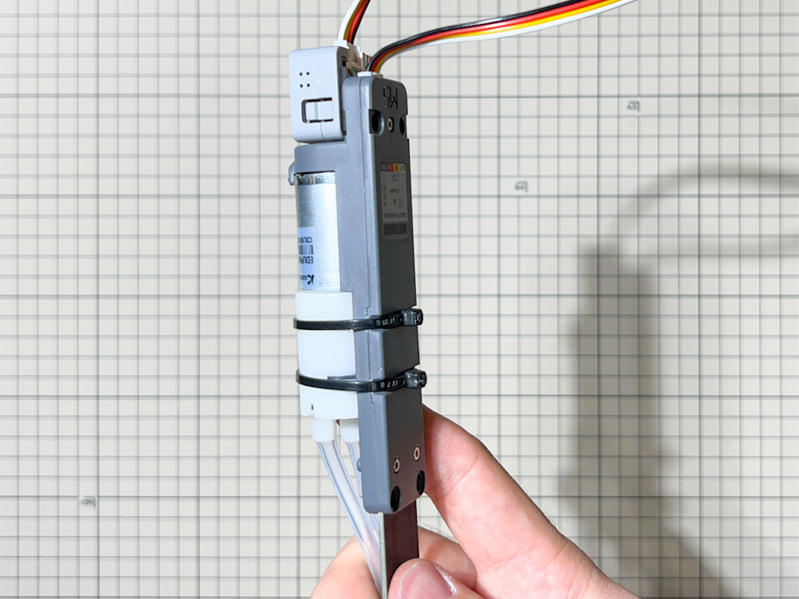

## 【D+IO Product #8】Watering Unitの作り方 
### 〜 種類の異なる植物の、水の管理ができるモジュール式栽培システム 〜

### プロダクト概要

種類の異なる植物の、水の管理ができるモジュール式栽培システム「Watering Unit」の作り方を紹介します。

このプロダクトはFUTURE LIFE FACTORYの「Second Nature」のコンセプトのひとつであるモジュール式栽培システムを
身近な素材や市販の電子部品を組み合わせて自作できるように作り方を公開しています。

詳しくはSecond Natureをご覧ください。

[Second Nature プロジェクトの紹介](https://panasonic.co.jp/design/flf/works/secondnature/)

 

##  D+IO Project

**パナソニック株式会社/FUTURE LIFE FACTORY**

[D+IO プロジェクト詳細](https://panasonic.co.jp/design/flf/works/doing_io/)

 

## 作り方
  
### 1 準備

- 必要なパーツを用意

|     | 部品名     | 個数 |  販売リンク（例）  | 備考 |
|:----:|:---------|:----|:------------------------|:----|
|  1  | M5Stack用 水分測定センサ付き給水ポンプユニット | 1 |[スイッチサイエンス](https://www.switch-science.com/catalog/6913/) | |
|  2  | ATOM Matrix | 1 |[スイッチサイエンス](https://www.switch-science.com/catalog/6260/) | |
|  3  | HY2.0 ケーブル (Groveケーブル) | 1 | | ポンプユニットに付属 |
|  4  | USB Type-Cケーブル | 1 | [スイッチサイエンス](https://www.switch-science.com/catalog/3792/) | 給電用 （必要に応じて適切な長さのUSBケーブルを購入してください） |
|  5  | ハウジング | 1 | [データ](./data/watering_unit_housing.stl) | 3Dプリンタを使って出力してください （身の回りにある素材などでご自身で制作してもOKです） |

★ 参考価格（総額） : 約4,000円

### 2 配線 / 組み立て

1. ポンプユニット の出っ張り部分をニッパーで切り取ります

    

    

1. ATOM Matrix と ポンプユニット を Groveケーブルで接続します。

    

1. ATOM Matrix と ポンプユニット を 両面テープで固定します。

    

1. モーターが固定されているインシュロックを回転させ、背面に接続部が来るようにします。

    

1. ハウジングをかぶせ、ATOM Matrix に USBケーブルを接続します。

    

### 3 開発環境のダウンロードとインストール

下記リンクを参考に開発環境をインストールしてください。

(今回使用するデバイスは【ATOM Matrix】です。FastLEDライブラリのインストールも必要です。)

[M5Stack開発環境のダウンロードとインストール](https://github.com/panasonic-corporation/doingio-base-docs/blob/master/README.md#a-m5stack%E9%96%8B%E7%99%BA%E7%92%B0%E5%A2%83%E3%81%AE%E3%83%80%E3%82%A6%E3%83%B3%E3%83%AD%E3%83%BC%E3%83%89%E3%81%A8%E3%82%A4%E3%83%B3%E3%82%B9%E3%83%88%E3%83%BC%E3%83%AB)

### 4 ファームウェアのダウンロード

1. ファームウェアをダウンロードしてください。

    こちらのリンクからzipファイルをダウンロード
    
    https://github.com/panasonic-corporation/doingio-watering-unit/archive/refs/heads/main.zip

1. プロジェクトを開いてください。

    ダウンロードしたフォルダを開き、doingio-watering-unit/doingio-watering-unit.ino をダブルクリックしてArduino IDEで開きます。

### 5 書き込み

1. PCとデバイスをUSBケーブルで接続し、Arduino IDEの「ツール」タブを開き下記の通り設定します。

    

1. 「書き込み」アイコンをクリックしてArduinoにファームウェアを書き込みます。

    

### 6 使用方法

1. Watering Unit のセンサー部を プランターなどの土にさします。

    

1. 給水パイプの片方をペットボトルなど水をためておくタンクにさします。

    

1. 給水パイプのもう一方をプランター内の土など水やりしたい箇所に刺すなどして固定します。

    

1. USBケーブルを電源に差すと起動します。

1. 与えたい土壌の水分量の目標値が左側の緑の表示、右側の青い表示が現在の水分量レベルです。水分量レベルが目標値を下回っているときにポンプが駆動してタンク内の水を与えます。

    

1. 表示パネルをプッシュすると目標値の設定ができます。

   

## ライブラリ及びライセンス
| ライブラリ名| 配布元 | コピーライトまたは貢献者 | ライセンス |
|:---|:----|:----|:----|
|M5Atom|[URL](https://github.com/m5stack/M5Atom)|Copyright (c) 2021 by M5Stack|[LICENSE](https://github.com/m5stack/M5Atom/blob/master/LICENSE)|
| FastLED | [URL](https://github.com/FastLED/FastLED) | Copyright (c) 2013 FastLED | [LICENSE](https://github.com/FastLED/FastLED/blob/master/LICENSE) |
